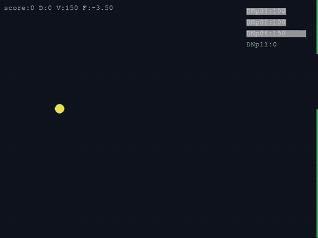

<div align="center">

# flybywire

**A simulated *Drosophila* escape circuit, built from the FlyWire connectome, playing Flappy Bird in a closed loop.**

*No reinforcement learning. No artificial weights. No world model. 440 biological neurons steering through threat avoidance.*

<br>



<sub>The fly (yellow circle) navigates obstacles in real time. Dynamic bars display descending neuron firing rates.<br>
Blue = **DNp11** (dorsal threat response / dive), Orange = **DNp02** (ventral threat response / climb). High-res video: [`game.mp4`](game.mp4)</sub>

</div>

---

## Overview

**flybywire** demonstrates how complex spatial navigation can emerge directly from the biological wiring of an organism's brain. 

Using the whole-brain connectome of *Drosophila melanogaster* (**FlyWire v783**, ~139,255 neurons and ~50M synapses) simulated via leaky integrate-and-fire (LIF) dynamics ([Shiu et al., *Nature* 2024](https://www.nature.com/articles/s41586-024-07981-1)), this project investigates how the fly visual escape circuit encodes threat elevation:

> **How does the fly escape circuit distinguish looming threats from above versus below, and can this wiring autonomously steer an agent through physical obstacles?**

By isolating the minimal functional pathway required for elevation-tuned escape, the 139,255-neuron network is reduced to an exact **440-neuron subcircuit** (0.3% of the brain) that runs in real time and drives a closed-loop sensorimotor Flappy Bird agent.

---

## Table of Contents

- [Circuit Architecture](#circuit-architecture)
- [Methodology](#methodology)
- [Key Findings](#key-findings)
  - [1. Elevation Tuning in Descending Neurons](#1-elevation-tuning-in-descending-neurons)
  - [2. Synaptic Substrate: LC4 Directs the Elevation Signal](#2-synaptic-substrate-lc4-directs-the-elevation-signal)
  - [3. Non-Cancelling Dual-Threat Integration](#3-non-cancelling-dual-threat-integration)
  - [4. Smooth Dorsoventral Synaptic Gradient](#4-smooth-dorsoventral-synaptic-gradient)
- [The 440-Neuron Subcircuit Reduction](#the-440-neuron-subcircuit-reduction)
- [Closed-Loop Sensorimotor Demo](#closed-loop-sensorimotor-demo)
- [Neuron Glossary](#neuron-glossary)
- [Installation and Reproduction](#installation-and-reproduction)
- [References](#references)

---

## Circuit Architecture

When a visual threat looms toward a fruit fly, a specialized visuomotor circuit detects the expansion and commands an evasive jump and steering maneuvers:

```
                  Visual Looming Stimulus
                             │
            ┌────────────────┴────────────────┐
          LPLC2                              LC4
    (angular size detector)           (angular velocity detector)
    210 neurons                       104 neurons
            │                                 │
            ├────────────────┬────────────────┤
            │                │                │
            ▼                ▼                ▼
         DNp01             DNp11            DNp02 / DNp04
      (Giant Fiber)    (forward escape,    (backward/lateral escape,
     Escape Trigger      dorsal-tuned)       ventral-biased)
```

- **LPLC2**: Visual projection neurons tuned to outward optical expansion and angular size.
- **LC4**: Visual projection neurons sensitive to high-speed expansion and angular velocity.
- **DNp01 (Giant Fiber)**: The primary escape trigger neuron commanding immediate jump takeoff.
- **DNp11, DNp02, DNp04**: Descending neurons that modulate the trajectory and directional heading of the escape.

---

## Methodology

### Visual Input Population and Dorsoventral Split

To test spatial elevation tuning, receptive fields were determined anatomically from synaptic coordinates. For all **314 looming detector neurons** (210 LPLC2 and 104 LC4), the 3D spatial centroid of input synapses was calculated along the dorsoventral ($Y$) axis across **34,156,320** FlyWire synapses (`synapse_coordinates.csv`).

| Population | Type | Total Count | Dorsal Group | Ventral Group |
|---|---|---:|---:|---:|
| **LPLC2** | Angular size detector | 210 | 105 | 105 |
| **LC4** | Angular velocity detector | 104 | 52 | 52 |
| **Total Inputs** | | **314** | **157** | **157** |

### Stimulation Protocol

Inputs were stimulated with 150 Hz Poisson spike trains (`f_poi = 250`), matching the validated biophysical parameters from [Shiu et al. (2024)](https://github.com/philshiu/Drosophila_brain_model). Descending neuron spike trains were recorded across three conditions:

- **`dorsal_only`**: Stimulation of dorsal LPLC2 + LC4.
- **`ventral_only`**: Stimulation of ventral LPLC2 + LC4.
- **`dual`**: Simultaneous stimulation of all dorsal and ventral inputs.

---

## Key Findings

### 1. Elevation Tuning in Descending Neurons

Simulations of the connectome reveal strong elevation selectivity in descending pathways from wiring alone ($n = 10$ trials, mean $\pm$ SD firing rate in Hz):

| Descending Neuron | Role | Dorsal Threat | Ventral Threat | $\Delta$ (Dorsal − Ventral) |
|---|---|---:|---:|---:|
| **DNp11** | Forward escape | **102.8 $\pm$ 1.4** | **15.1 $\pm$ 1.9** | **+87.8 Hz (Dorsal-tuned)** |
| **DNp01 (Giant Fiber)** | Escape trigger | 156.4 $\pm$ 1.8 | 136.2 $\pm$ 2.0 | +20.2 Hz (Dorsal bias) |
| **DNp02** | Backward escape | 73.5 $\pm$ 1.3 | 96.9 $\pm$ 0.9 | −23.5 Hz (Ventral-tuned) |
| **DNp04** | Lateral escape | 149.8 $\pm$ 1.0 | 179.1 $\pm$ 0.5 | −29.2 Hz (Ventral bias) |

**DNp11 displays a ~7-fold increase in firing rate for looming threats positioned above compared to below.** Conversely, **DNp02** and **DNp04** exhibit ventral preference, establishing antagonistic elevation channels.

---

### 2. Synaptic Substrate: LC4 Directs the Elevation Signal

Analyzing the synaptic connectivity matrix highlights the precise structural origin of this directional preference:

| Descending Neuron | Synaptic Weight from **LPLC2** | Synaptic Weight from **LC4** | LC4 Input Share | % of Total Cell Input |
|---|---:|---:|---:|---:|
| **DNp11** | 19 | **923** | **98.0%** | 11.3% |
| **DNp02** | 5 | **1001** | **99.5%** | 18.7% |
| **DNp04** | 1212 | **1854** | **60.5%** | 55.4% |
| **DNp01 (Giant Fiber)** | **1080** | 805 | 42.7% | 19.9% |

- **LC4 is the primary driver of directional tuning**: DNp11 and DNp02 receive over 98% of their looming input from LC4.
- **LPLC2 predominantly targets the Giant Fiber**: Providing the strong, size-dependent drive required for escape initiation.

---

### 3. Non-Cancelling Dual-Threat Integration

When dorsal and ventral threats are presented simultaneously (`dual`), descending neurons integrate excitatory drive rather than nullifying each other:

| Descending Neuron | Dorsal (Hz) | Ventral (Hz) | Dual Threat (Hz) | Dual / Max(Single) |
|---|---:|---:|---:|---:|
| **DNp01 (Giant Fiber)** | 156.4 | 136.2 | **185.2** | 1.18× |
| **DNp11** | 102.8 | 15.1 | **109.6** | 1.07× |
| **DNp04** | 149.8 | 179.1 | **214.4** | 1.20× |
| **DNp02** | 73.5 | 96.9 | **136.7** | 1.41× |

DNp11 maintains its full dorsal response magnitude during dual stimulation (109.6 Hz vs 102.8 Hz), confirming that opposing looming threats do not cancel out directional drive.

---

### 4. Smooth Dorsoventral Synaptic Gradient

Binning sensory inputs into dorsoventral quintiles ($Q_1$ dorsal to $Q_5$ ventral) demonstrates that elevation tuning arises from a continuous, monotonic gradient in synaptic density:

| Descending Neuron | $Q_1$ (Dorsal) | $Q_2$ | $Q_3$ | $Q_4$ | $Q_5$ (Ventral) | Gradient Profile |
|---|---:|---:|---:|---:|---:|---|
| **DNp11** | **6.0** | 3.3 | 2.1 | 1.8 | **1.7** | **Monotonic $\downarrow$ (3.5× ratio)** |
| **DNp01** | 7.7 | 6.2 | 5.9 | 5.4 | 4.8 | Monotonic $\downarrow$ (1.6× ratio) |
| **DNp04** | 8.1 | 8.0 | 8.4 | 9.7 | 14.7 | Monotonic $\uparrow$ (1.8× ratio) |
| **DNp02** | 2.9 | 2.8 | 2.7 | 3.2 | 4.5 | Ventral-weighted |

*(Values represent mean synaptic input weight per sensory neuron across dorsoventral quintiles).*

---

## The 440-Neuron Subcircuit Reduction

Simulating the complete 139,255-neuron brain requires ~46 s of computation per simulated second. Graph traversal (backward BFS from descending outputs to visual inputs with a $\ge 5$ synapse threshold) extracts an exact **440-neuron subcircuit** (0.3% of the brain):

```
440 Neurons = 314 Sensory Inputs (LPLC2 + LC4)
            +  14 Descending Outputs (DNp01, DNp02, DNp04, DNp11, DNa01, DNa02)
            + 112 Interneurons
            = 23,081 Synaptic Connections
```

### Subcircuit Validation

Comparing the 440-neuron subcircuit against the 139,255-neuron whole-brain model confirms that the escape axis is preserved with high precision:

| Descending Neuron | Condition | Full Brain (Hz) | Subcircuit (Hz) | Fidelity |
|---|---|---:|---:|---:|
| **DNp11** | Dorsal | 102.8 | 104.8 | **98.1% match (+2%)** |
| **DNp04** | Dorsal | 149.8 | 153.1 | **97.8% match (+2%)** |
| **DNp02** | Dorsal | 73.5 | 73.0 | **99.3% match (−1%)** |
| **DNp01 (Giant Fiber)** | Dorsal | 156.4 | 145.1 | **92.8% match (−7%)** |

By instantiating the subcircuit in a persistent Brian2 network wrapper (`brain_game.py`), network recreation overhead is eliminated, enabling near-instantaneous continuous execution.

---

## Closed-Loop Sensorimotor Demo

<div align="center">

</div>

The 440-neuron circuit is connected to an interactive Flappy Bird simulation running in a closed sensorimotor loop:

```
    ┌────────────────────────────────────────────────────────┐
    │                      Flappy Bird Game                  │
    │  - Evaluates distance to upper and lower pipe walls    │
    │  - Updates agent vertical position and velocity        │
    └───────────────────────────┬────────────────────────────┘
                                │ Wall Proximities
                                ▼
    ┌────────────────────────────────────────────────────────┐
    │                   Sensorimotor Mapping                 │
    │  - Upper wall proximity  ──►  Dorsal Poisson Drive     │
    │  - Lower wall proximity  ──►  Ventral Poisson Drive    │
    └───────────────────────────┬────────────────────────────┘
                                │ 150 Hz Poisson Stimulus
                                ▼
    ┌────────────────────────────────────────────────────────┐
    │              440-Neuron Connectome Subcircuit          │
    │  - Steps biological LIF dynamics (Brian2, dt = 20 ms)  │
    │  - Computes DNp11 (dorsal) & DNp02 (ventral) rates     │
    └───────────────────────────┬────────────────────────────┘
                                │ Differential Rate: (DNp11 - DNp02)
                                ▼
    ┌────────────────────────────────────────────────────────┐
    │                     Motor Actuation                    │
    │  - Vertical flight force applied to agent              │
    └────────────────────────────────────────────────────────┘
```

### Emergent Spatial Navigation

- **No Artificial Target**: The fly is never given the coordinates of the gap.
- **Autonomous Avoidance**: Proximity to the ceiling/upper pipe excites dorsal inputs $\rightarrow$ activates **DNp11** $\rightarrow$ pushes the fly downward. Proximity to the floor/lower pipe excites ventral inputs $\rightarrow$ activates **DNp02** $\rightarrow$ pushes the fly upward.
- **Result**: The agent smoothly navigates complex corridors purely by balancing opposing escape drives.

---

## Neuron Glossary

### Stimulated — Visual Looming Detectors

- **LPLC2** (Lobula Plate/Lobula Columnar type 2): Sensitive to outward radial expansion and object angular size. Directly synapses onto the Giant Fiber (DNp01).
- **LC4** (Lobula Columnar type 4): Sensitive to high-speed visual looming and angular velocity. Directly drives the directional descending neurons (DNp11, DNp02, DNp04).

### Recorded — Descending Neurons (DNs)

- **DNp01 (Giant Fiber)**: Primary escape trigger neuron commanding the all-or-none jump response.
- **DNp11**: Descending neuron tuned to dorsal looming; mediates downward pitch and forward trajectory adjustments.
- **DNp02**: Descending neuron tuned to ventral looming; contributes to upward/backward escape maneuvers.
- **DNp04**: Descending neuron with ventral bias contributing to broad escape drive.
- **DNa01 / DNa02**: Steering descending neurons involved in asymmetric turning control.

---

## Installation and Reproduction

### 1. Environment Setup

```bash
# Clone the repository
git clone https://github.com/RaymonDev/flybywire.git
cd flybywire

# Create and activate environment
conda create -n fly_brain python=3.10 -y
conda activate fly_brain

# Install dependencies
pip install brian2 pandas numpy pyarrow joblib pygame
```

### 2. Connectome Data Setup

Download the FlyWire v783 dataset and Shiu et al. (2024) model:

```bash
git clone https://github.com/philshiu/Drosophila_brain_model
```

Ensure the following annotation files from the [FlyWire Codex FAFB Portal](https://codex.flywire.ai/api/download?dataset=fafb) are in the project root:
- `visual_neuron_types.csv`
- `consolidated_cell_types.csv`
- `classification.csv`
- `synapse_coordinates.csv`

### 3. Pipeline Execution

```bash
# 1. Extract neuron IDs and compute synaptic centroids
python get_ids.py
python split_by_synapses.py

# 2. Run simulation experiments
python experiment_syn.py
python analyze_syn_std.py

# 3. Extract and validate the 440-neuron subcircuit
python extract_subcricuit.py
python validate_subcircuit.py

# 4. Run the closed-loop Flappy Bird demo
python run_game.py

# (Optional) Render video from saved frames
ffmpeg -framerate 30 -i game_frames/frame_%04d.png -pix_fmt yuv420p game.mp4
```

---

## References

1. **Shiu PK et al. (2024).** A *Drosophila* computational brain model reveals sensorimotor processing. *Nature* **634**, 210–219. [DOI: 10.1038/s41586-024-07981-1](https://doi.org/10.1038/s41586-024-07981-1).
2. **Dombrovski M et al. (2023).** Synaptic gradients transform object location to action. *Nature* **613**, 534–542. [DOI: 10.1038/s41586-022-05562-8](https://doi.org/10.1038/s41586-022-05562-8).
3. **Rehan A et al. (2025).** Molecular gradients shape synaptic specificity of a visuomotor transformation. *Nature*. [DOI: 10.1038/s41586-024-08534-2](https://doi.org/10.1038/s41586-024-08534-2).
4. **von Reyn CR et al. (2017).** Feature integration drives probabilistic behavior in the *Drosophila* escape response. *Neuron* **94**(6), 1190–1204.
5. **Dorkenwald S et al. (2024).** Neuronal wiring diagram of an adult brain. *Nature* **634**, 124–138.
6. **Schlegel P et al. (2024).** Whole-brain annotation and multi-connectome marker analysis of *Drosophila*. *Nature* **634**, 139–152.

---

<div align="center">

**The connectome is the model. The wiring is the hypothesis.**

</div>
